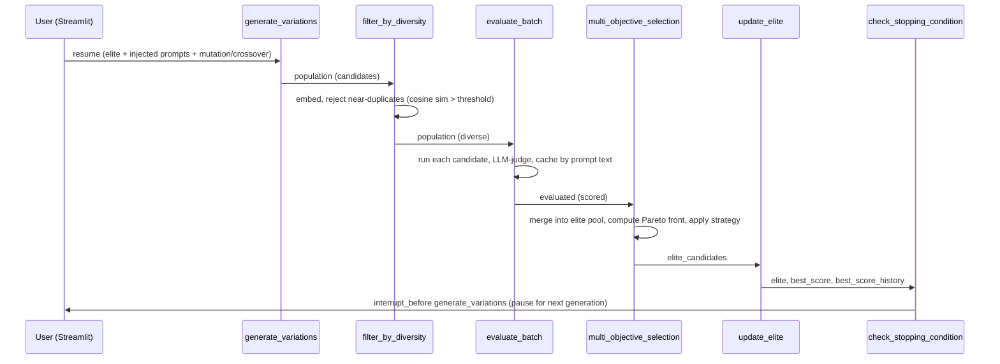

# Architecture

Audited against local checkout `fabdde6af20e3cb23d5cd35c39f9f04ba3aec698` on
`main` (remote `https://github.com/pypi-ahmad/self-improving-prompt-optimizer.git`),
2026-08-17. License: MIT (`LICENSE`). Citations point to files in this
checkout.

## What this is

An agentic system that evolves a system prompt across generations —
mutating, crossing over, evaluating, and selecting candidates with
multi-objective LLM-as-judge scoring — until it converges on the
best-performing version against a fixed or auto-generated benchmark
(`README.md:3`). It is local-first: it runs on the user's machine with
their own API key, and (unlike similar projects) does not persist
optimization run state to disk at all.

## Tech stack

| Layer | Technology | Evidence |
|---|---|---|
| UI | Streamlit | `app.py:15,31` |
| Orchestration | LangGraph `StateGraph`, `InMemorySaver` checkpointer, `interrupt_before` | `graph.py:18-19,329` |
| LLM/embedding client | `langchain_openai.ChatOpenAI` / `OpenAIEmbeddings`; raw `openai.OpenAI` client for model listing | `evaluator.py:11-12` |
| LLM backend | Any OpenAI-compatible API (`OPENAI_API_KEY`/`OPENAI_BASE_URL`), plus an optional second provider (Agnes AI) | `evaluator.py:25-27,34-38` |
| Env loading | `python-dotenv` | `app.py:16,22` |
| Package management | `uv` | `pyproject.toml`, `run_app.cmd` |

## Entry point

`uv run streamlit run app.py` (or `run_app.cmd` on Windows, which
additionally checks for `uv`, warns if `OPENAI_API_KEY` is unset, and runs
`uv sync` before launching). `app.py` is the only entry point — no CLI
exists (noted as a Future Improvement in `README.md:222`).

## Commands & Verification Inventory

| Command | Purpose | Evidence |
|---|---|---|
| `uv sync` | Install dependencies from `uv.lock` | `pyproject.toml` |
| `uv run streamlit run app.py` | Run the app (serves on port 8531 per `.streamlit/config.toml`) | `.streamlit/config.toml` |
| `run_app.cmd` | Windows one-click setup + launch | `run_app.cmd` |

**No lint config, no automated test suite, and no CI workflow exist** in
this checkout — confirmed by directory listing (no `tests/`, no
`.github/workflows/`) and by `pyproject.toml` having no `dev` dependency
group at all (unlike this author's other repos, which at least declare
`ruff`). `CONTRIBUTING.md` states this explicitly.

## Directory layout

| Path | Purpose |
|---|---|
| `app.py` | Streamlit UI: sidebar config, run driver (start/stop/resume/inject), tabbed results |
| `graph.py` | LangGraph workflow: `OptimizerState` schema + the 7 optimization nodes |
| `evaluator.py` | Model/embedding client factory, candidate execution, LLM-as-judge scoring |
| `benchmark.py` | Fixed 8-case benchmark + LLM-driven benchmark auto-generation |
| `prompts.py` | Default base prompt/task description + every meta-prompt template (mutation, crossover, judge, benchmark generation) |
| `utils.py` | Pure-stdlib helpers: cosine similarity, Pareto-dominance/front, weighted scoring |

## Deployment & runtime surface

Local-only; no container, no CI runner image, no deployed service. Python
`>=3.13` (`pyproject.toml:5`, `.python-version` pins `3.13`). Streamlit is
pinned to port `8531` via `.streamlit/config.toml`. The only artifact ever
written to disk is `data/generated_benchmark.json`
(`benchmark.py:13,60-62`), created on first "Generate benchmark" click —
everything else, including full optimization run state, lives only in
process memory (see the "No persistence" ADR below).

## EOL / dead-dependency scan

Nothing EOL `[INFERRED — no version pins exist in pyproject.toml/uv.lock
that were checked against advisory databases beyond a manual read]`. No
dead-config or unreachable-provider issues found — the single
`EXTRA_PROVIDERS` entry (`agnes-2.5-flash`) is live and reachable through
the model dropdown whenever `AGNES_API_KEY` is set (`evaluator.py:25-27,77-78`).

## Data, APIs, background jobs, CI/CD, testing

- **Data:** exactly one file, `data/generated_benchmark.json` — an
  auto-generated benchmark, unencrypted, overwritten wholesale on
  regeneration (`benchmark.py:60-62`). No other run data is ever written
  to disk.
- **APIs:** none exposed by this app; it is a client of the configured
  OpenAI-compatible endpoint (chat completions + embeddings) and,
  optionally, Agnes AI's OpenAI-compatible endpoint.
- **Background jobs:** none — a generation executes synchronously inside
  `graph.invoke(None, config)`, driven by a Streamlit button click or the
  "Run continuously" auto-rerun loop (`app.py:66-74,281-293`).
- **CI/CD:** none exists.
- **Testing:** none exists (see Commands inventory above).

## Architectural blueprint

```mermaid
flowchart TD
    UI[Streamlit UI\napp.py] -->|graph.invoke(None, config)| G[Compiled StateGraph\ngraph.py]
    START --> Init[initialize_population]
    Init --> GV[generate_variations]
    GV -->|interrupt_before here| FD[filter_by_diversity]
    FD --> EB[evaluate_batch]
    EB --> MOS[multi_objective_selection]
    MOS --> UE[update_elite]
    UE --> CSC[check_stopping_condition]
    CSC -->|continue| GV
    CSC -->|stop| END
    GV -->|mutation/crossover| Reasoning[(OpenAI-compatible\nor Agnes AI)]
    FD -->|embeddings| Reasoning
    EB -->|run + judge| Reasoning
    UI -->|update_state pending_injections| G
```



**Layering:** `app.py` (UI) → `graph.py` (orchestration) → `evaluator.py` /
`benchmark.py` / `utils.py` / `prompts.py` (leaf dependencies). Nothing
outside `app.py` imports Streamlit; nothing outside `graph.py` and
`app.py` drives the LangGraph state machine.

**Cross-cutting concerns**

| Concern | Location | Evidence |
|---|---|---|
| Config/secrets | `.env` via `python-dotenv`, read once at import time; OS env vars take precedence | `app.py:16,22` |
| Model routing | `evaluator._credentials_for()` is the single choke point that maps a model name to its API key/base URL, including the `EXTRA_PROVIDERS` lookup | `evaluator.py:34-38` |
| Error handling | Every LLM call in `generate_variations`/`judge_output`/`evaluate_prompt`/`embed_texts` catches broad `Exception` and degrades (skip mutation, neutral fallback score, skip diversity filter) rather than crashing the run | `graph.py:124-153`, `evaluator.py:95-101,137-146` |
| Caching | `score_cache` keyed by exact prompt text avoids re-judging elites carried forward unchanged | `graph.py:203-214` |
| Human-in-the-loop | `interrupt_before=["generate_variations"]` plus `graph.update_state` for injection are the only two points where the UI can alter a running graph | `graph.py:329`, `app.py:276` |

**Inferred ADRs**

- **ADR: No persistence layer for optimization runs.** *Context:* unlike
  this author's other LangGraph projects (which use `SqliteSaver` for
  cross-session memory), this one uses `InMemorySaver`
  (`graph.py:18,329`). *Decision:* run state — population, elite pool,
  history, score cache — lives only in the Python process's memory for the
  lifetime of the Streamlit session. *Consequences:* restarting the app or
  the process loses all run history; the tradeoff buys simplicity (no
  schema, no migration, no disk I/O) for a tool whose runs are typically
  short, interactive, and disposable. This is also why `DISCLAIMER.md`
  explicitly calls out that run state is not persisted, unlike the one
  file (`data/generated_benchmark.json`) that is.
- **ADR: Deterministic Pareto-front/weighted-score selection, not an LLM
  decision.** *Context:* choosing which candidates survive to the next
  generation must be reproducible and free, not another judge call.
  *Decision:* `multi_objective_selection` computes the Pareto front
  (`utils.pareto_front`) and weighted ranking in plain Python
  (`graph.py:233-263`); the LLM is only used earlier, to generate
  candidates and judge their outputs. *Consequences:* selection is fast
  and reproducible for a given score set, at the cost of an O(n²)
  pairwise dominance check — accepted explicitly via a `ponytail:` comment
  in `utils.py:53-55` as fine at this project's population scale (tens,
  not thousands).
- **ADR: The diversity filter never empties a generation.** *Context:* if
  every candidate happens to be a near-duplicate of an elite, rejecting
  all of them would deadlock the loop with zero candidates to evaluate.
  *Decision:* `filter_by_diversity` explicitly keeps one candidate anyway
  when the reject loop would otherwise leave `kept` empty
  (`graph.py:187-190`). *Consequences:* a generation can occasionally
  contain a near-duplicate against the operator's intent, which is
  preferable to the run silently stalling.
- **ADR: `interrupt_before` + one-call-per-generation, not a background
  thread.** *Context:* Stop/Resume and mid-run prompt injection need a
  natural pause point without adding thread-safety concerns to a
  Streamlit app (which reruns its whole script per interaction).
  *Decision:* the graph is compiled with `interrupt_before=["generate_variations"]`
  so `graph.invoke(None, config)` resolves exactly one generation and then
  returns control to `app.py` (`graph.py:327-329`). *Consequences:* the UI
  can inject a prompt via `graph.update_state` or simply not call
  `invoke` again to "stop" — no thread cancellation logic needed anywhere.

**Governance:** none — no CODEOWNERS, no branch protection, no CI to
protect against in the first place. `CONTRIBUTING.md` and the PR template
are the only process guardrails, both advisory.

**How to add a feature:** add or modify a node in `graph.py`, extend
`OptimizerState` if new fields are needed, add any new prompt templates to
`prompts.py` (never inline new prompt text elsewhere), and update
`README.md`'s Features/How-It-Works/Configuration Options sections in the
same change (convention only, nothing enforces it).

## Subsystem deep-dives

### 1. The generation loop and elitism (`graph.py`)

Each call to `generate_variations` first re-adds every current elite
unchanged (`add(e["prompt"], "elite")`, `graph.py:112-113`), then any
user-injected prompts, then fills the remainder of `population_size` with
LLM-generated mutations and — once at least 2 elites exist — crossovers
(`graph.py:120-122`: `cross_n = remaining // 2` when both `len(elite) >= 2`
and `remaining >= 2`). This is why the very first generation (no elites
yet) is pure mutation seeded from `base_prompt`, and why crossover only
appears once the elite pool has grown past a single prompt. Both the
mutation and crossover LLM calls are wrapped independently in
`try/except`, so a mutation failure doesn't prevent crossover from still
contributing candidates that generation (`graph.py:124-153`).

### 2. Diversity filtering and score caching (`graph.py`, `evaluator.py`)

`filter_by_diversity` embeds every candidate and rejects any whose cosine
similarity to an elite **or another candidate already accepted this
generation** exceeds `diversity_threshold` (`graph.py:178-185`) — the
`kept_vectors` accumulator means diversity is enforced within the new
batch too, not just against history. If the embeddings endpoint fails
entirely, the filter is skipped for that generation rather than failing
the run (`evaluator.py:137-146`, `graph.py:173-174`). Separately,
`evaluate_batch` checks `score_cache` (keyed by exact prompt text, carried
in `OptimizerState` across generations) before spending a judge call —
this is what makes elitism cheap: an elite prompt carried forward
unchanged is a guaranteed cache hit (`graph.py:207-214`).

### 3. Multi-objective selection strategies (`graph.py`, `utils.py`)

All three strategies operate on the same merged pool — every current
elite plus this generation's evaluated candidates, deduplicated by prompt
text and keeping the higher-scoring instance (`graph.py:240-245`). `Pareto
Front` keeps only candidates no other pool member dominates on every
metric (`utils.is_dominated`, `utils.pareto_front`); `Weighted Score` is a
plain top-N sort; `Hybrid` (the default) unions the Pareto front with the
top-weighted candidates until the cap is filled (`graph.py:254-260`). The
cap itself is `max(population_size, 3)` (`graph.py:238`) — a floor that
matters when a user sets population size below 3.

## Confidence assessment

| Claim area | Confidence |
|---|---|
| LangGraph loop structure, elitism, and interrupt-based pausing | High — read directly from `graph.py` |
| No persistence of run state (in-memory checkpointer only) | High — confirmed via `InMemorySaver` import and directory listing (no session DB file) |
| Selection-strategy math (Pareto front, weighted score, hybrid cap) | High — read directly from `utils.py`, `graph.py` |
| Diversity filter's within-batch enforcement | High — read directly from `graph.py:176-185` (`kept_vectors` accumulator) |
| LLM-as-judge score reliability at scale | Inferred — no benchmark of judge consistency was run; conclusion follows from `evaluator.py`'s fallback-to-neutral-score behavior being a documented, deliberate degradation rather than a measured accuracy claim |

## Footnotes

- `README.md` — features, tech stack, setup, env vars, architecture narrative
- `graph.py` — LangGraph state schema, all 7 optimization nodes, graph construction
- `evaluator.py` — model/embedding factory, candidate execution, LLM-as-judge scoring
- `benchmark.py` — fixed benchmark, auto-generation, persistence
- `prompts.py` — default prompt/task description, every meta-prompt template
- `utils.py` — cosine similarity, Pareto-dominance/front, weighted scoring
- `app.py` — Streamlit UI, run driver, results rendering
