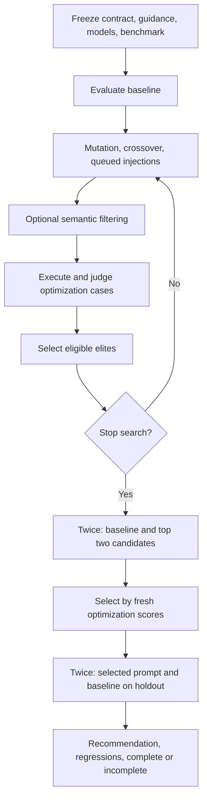

# Architecture

The local Streamlit application owns one runtime and LangGraph instance for each prepared run. It freezes settings, the original task contract, both guidance snapshots, and benchmark splits before searching. Provider clients and locks remain outside serialized graph state.

## Components

| Module | Responsibility |
|---|---|
| `app.py` | Configuration, preparation, stepping, Stop/Resume, injection, results, downloads |
| `contracts.py` | Task/model/result types, fingerprints, guidance snapshots, JSON validation, literal/schema checks, credential placeholders |
| `prompts.py` | Role-specific messages built from selected guidance sections |
| `runtime.py` | Provider routing, shared concurrency, budget reservations, retry accounting, usage summaries |
| `benchmark.py` | Built-in split, task-bound validation, generated/saved/imported benchmarks |
| `evaluator.py` | Candidate execution, independent judging, deterministic checks, aggregation, comparison |
| `graph.py` | Search, caching, elite selection, finalist and holdout stages |
| `reporting.py` | History CSV and versioned full-run JSON |
| `utils.py` | Weighted scoring, cosine similarity, Pareto dominance |

## Workflow

LangGraph interrupts before `generate`, `finalists`, and `holdout`. Streamlit advances one stage with `graph.invoke(None, thread_config)`. Reading a checkpoint or downloading a result does not evaluate anything. Worker threads run case jobs and return values in input order without accessing Streamlit state.

Holdout cases are never included in variation feedback. The holdout stage cannot choose a new finalist or route back into search. Initial baseline evaluation is independent of diversity filtering and remains in the run history even if it is ineligible.

## Model and budget boundary

The runtime calls the OpenAI-compatible Chat Completions API through the OpenAI SDK. Generation and candidate execution default to `gpt-5.6-luna`; judging defaults to `gpt-5.6-terra`, both with medium reasoning effort. The SDK's automatic retries are disabled. One counted retry is allowed for transient failures.

Each runtime uses a semaphore for concurrency and a lock for allowance reservations. Before every attempt, it reserves uncached input and maximum completion costs. Completed requests reconcile against reported token usage. Errors without usage retain the reservation. Optional embeddings use the same boundary and need explicit pricing.

Run defaults are four concurrent requests, 1,000 attempts, and $6. Search termination considers estimated final-validation work, while each request admission enforces the remaining allowance. Work that cannot finish is recorded as incomplete rather than as a measured improvement.

## State and storage

Graph state contains serializable task/configuration data, guidance versions and hashes, benchmark splits, candidate history, caches, evaluation records, phase, comparison, and usage snapshots. Runtime clients, thread locks, and semaphores are not serialized.

- Application checkpoints: `InMemorySaver`; lost when the process or session is replaced.
- Generated benchmark: `data/generated_benchmark.json`, overwritten after successful generation.
- Downloads: explicit browser exports, including a complete versioned run JSON.
- Live verification only: `artifacts/verification_budget.json` and `artifacts/live_smoke.json`; ignored by Git.

The application has no database, hosted backend, external skill dependency, or automatic run-replay service. Both guidance documents are repository-owned adaptations with provenance in their headers.
