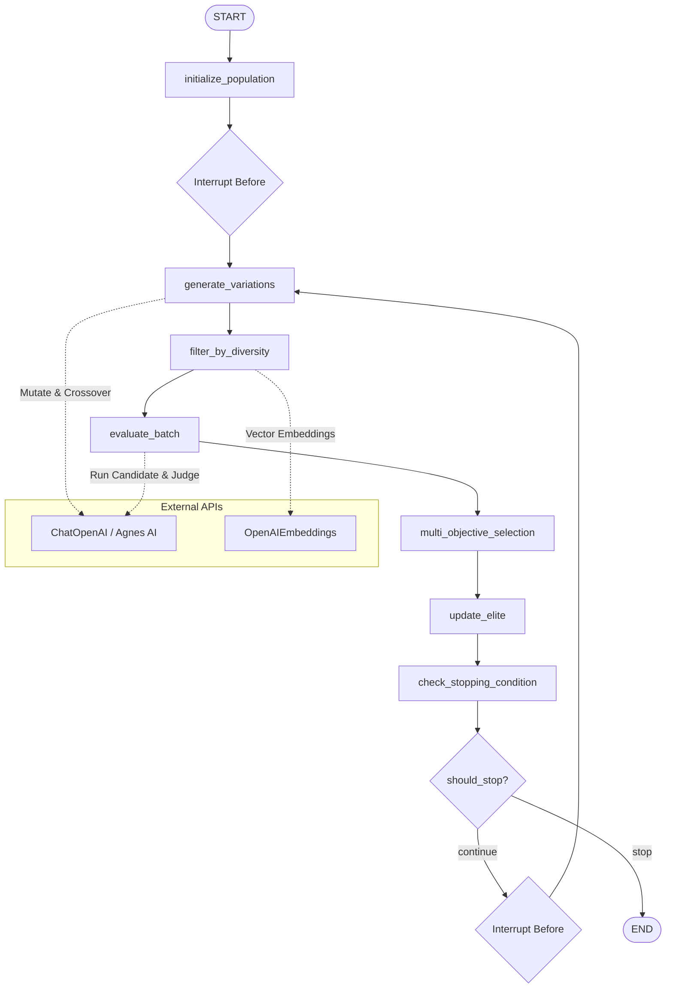
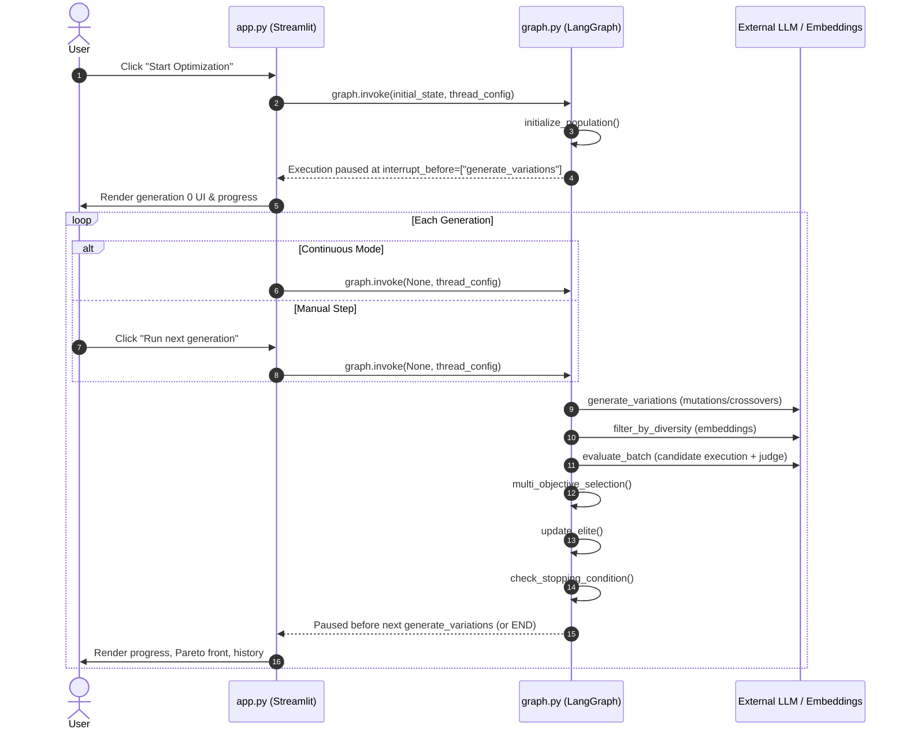
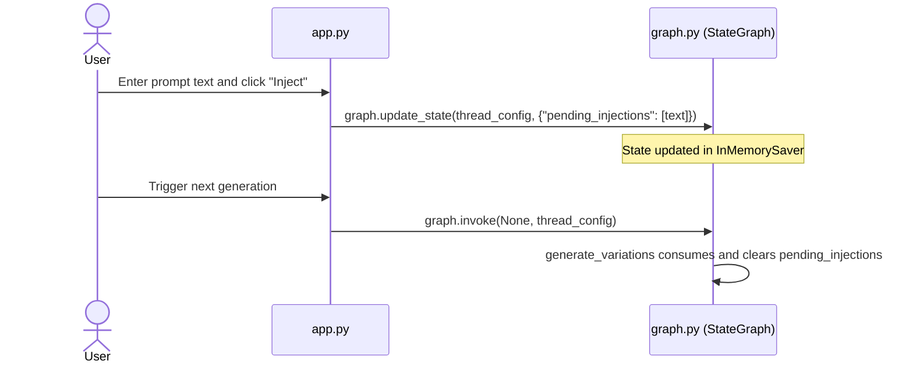

# Architecture

This document describes the architectural design, execution flow, state schema, and external system dependencies of Self-Improving Prompt Optimizer.

## Overview

Self-Improving Prompt Optimizer is a local-first application that iteratively evolves a system prompt against a benchmark test suite. The core optimization loop is orchestrated using LangGraph (`StateGraph`), with execution state held in memory via `InMemorySaver`. A Streamlit web interface drives the workflow one generation at a time using execution interrupts.

## Subsystems

The codebase is organized into six functional modules:

```
app.py (Streamlit UI & Run Driver)
  │
  ├──> graph.py (LangGraph State Machine & Optimization Loop)
  │      │
  │      ├──> evaluator.py (LLM Execution, Scoring & Embeddings)
  │      │      └──> prompts.py (Prompt Templates)
  │      │
  │      ├──> benchmark.py (Benchmark Dataset & Auto-Generation)
  │      │      └──> prompts.py
  │      │
  │      └──> utils.py (Math & Filtering Algorithms)
  │
  └──> utils.py
```

- `app.py`: Web user interface, sidebar parameter inputs, generation step triggering, state visualization, and data export.
- `graph.py`: LangGraph state graph definition, state transitions, node operations, elitism management, and convergence checks.
- `evaluator.py`: Provider client configuration, candidate output generation, LLM-as-judge scoring, consistency calculation, and vector embeddings.
- `benchmark.py`: Fixed 8-case test benchmark, disk serialization for auto-generated benchmarks, and LLM-driven benchmark synthesis.
- `prompts.py`: Base task instructions and meta-prompts enforcing strict JSON output schemas.
- `utils.py`: Pure standard-library helper functions for cosine similarity, Pareto-front calculation, weighted scoring, and markdown fence removal.

## Request and data flow

### Generation lifecycle

Each optimization generation executes through seven sequential nodes in `graph.py`. The graph is compiled with `interrupt_before=["generate_variations"]`, which pauses execution immediately prior to starting a new generation.



### Detailed node responsibilities

1. `initialize_population`:
   - Runs once at the start of a thread.
   - Sets initial state attributes: `generation = 0`, empty candidate lists, empty `score_cache`, and initial `best_prompt` assigned to `base_prompt`.
2. `generate_variations`:
   - Carries forward all prompts from `state["elite"]` unchanged (elitism).
   - Ingests any user prompts queued in `state["pending_injections"]`.
   - If the candidate count is less than `population_size`, fills remaining slots using LLM generation:
     - When fewer than 2 elites exist: generates mutations from the top elite (or `base_prompt`).
     - When 2 or more elites exist: splits remaining slots between crossover of the top two elites and mutation.
3. `filter_by_diversity`:
   - Computes text embeddings for all new candidates using `OpenAIEmbeddings` (`text-embedding-3-small`).
   - Calculates pairwise cosine similarity against existing elite vectors and previously accepted candidates in the current generation.
   - Rejects candidates exceeding `diversity_threshold`.
   - Safety fallback: if all candidates exceed the threshold, retains the first candidate to prevent generation starvation.
   - Failure fallback: if embeddings cannot be retrieved, skips filtering and keeps all candidates.
4. `evaluate_batch`:
   - Evaluates each surviving candidate across the entire benchmark dataset.
   - Checks `score_cache` by exact prompt text; if matched, skips execution and reuses cached evaluation metrics and per-case outputs.
   - For cache misses, generates candidate outputs and executes LLM-as-judge scoring for each benchmark test case.
   - Computes the derived `consistency` score from variance across test cases.
   - Calculates the overall `weighted_score` using normalized metric weights.
5. `multi_objective_selection`:
   - Merges current elites with newly evaluated candidates into a unified pool, deduplicating by prompt string while keeping the higher-scoring entry.
   - Identifies non-dominated solutions across all five metrics via `pareto_front`.
   - Selects the next elite pool according to `selection_strategy`:
     - `weighted`: Top-N sorted strictly by `weighted_score`.
     - `pareto`: Non-dominated front sorted by `weighted_score`.
     - `hybrid`: Union of the Pareto front and top weighted candidates, capped at `max(population_size, 3)`.
6. `update_elite`:
   - Stores the selected elite list.
   - Checks if any candidate exceeds `best_score`; updates `best_prompt`, `best_score`, and `best_metrics`.
   - Appends current best score to `best_score_history`.
7. `check_stopping_condition`:
   - Evaluates stopping criteria:
     - `generation >= max_generations` (reason: "reached max generations").
     - Last 3 generations in `best_score_history` vary by less than `0.05` (reason: "plateaued (best score flat for 3 generations)").
   - Sets `should_stop = True` or routes back to `generate_variations`.

### Interaction between Streamlit and LangGraph

`app.py` drives the workflow synchronously. It does not spawn background workers or threading pools.



### Mid-run prompt injection

Users can manually queue candidate prompts during an active run:



## State schema and storage

### `OptimizerState` (`graph.py`)

The state schema is defined as a `TypedDict` containing configuration and mutable tracking fields:

| Field | Type | Description |
|---|---|---|
| `task_description` | `str` | Description of the prompt objective |
| `base_prompt` | `str` | Initial seed prompt |
| `benchmark` | `list[dict]` | Test cases containing `input` and `guideline` |
| `model_name` | `str` | Chat model identifier |
| `temperature` | `float` | Model sampling temperature |
| `population_size` | `int` | Target count of candidates per generation |
| `max_generations` | `int` | Upper boundary for total generations |
| `mutation_strength` | `str` | Mutation intensity (`"low"`, `"medium"`, or `"high"`) |
| `metric_weights` | `dict[str, float]` | Weights for accuracy, clarity, conciseness, helpfulness, consistency |
| `selection_strategy` | `str` | Strategy identifier (`"weighted"`, `"pareto"`, or `"hybrid"`) |
| `diversity_threshold` | `float` | Cosine similarity cutoff for semantic deduplication |
| `generation` | `int` | Current generation counter |
| `population` | `list[dict]` | Unscored candidates for current generation |
| `evaluated` | `list[dict]` | Evaluated candidates with metrics and per-case output |
| `elite_candidates` | `list[dict]` | Candidates selected during multi-objective selection |
| `elite` | `list[dict]` | Surviving elite pool carried across generations |
| `pareto_front` | `list[dict]` | Non-dominated candidate subset across all metrics |
| `score_cache` | `dict[str, dict]` | Cache mapping prompt string to `{"metrics", "per_case"}` |
| `best_prompt` | `str` | Highest-scoring prompt string discovered |
| `best_score` | `float` | Highest weighted score attained |
| `best_metrics` | `dict` | Metric dictionary corresponding to `best_prompt` |
| `best_score_history` | `list[float]` | Chronological record of best score per generation |
| `history` | `Annotated[list[dict], operator.add]` | Appended list of all evaluated candidate records |
| `pending_injections` | `list[str]` | User-supplied prompts queued for next generation |
| `should_stop` | `bool` | Flag set when stopping criteria are met |
| `stop_reason` | `str` | Text explanation of why the run terminated |
| `logs` | `Annotated[list[str], operator.add]` | Appended list of runtime execution log messages |

### Persistence characteristics

- **In-memory state**: `InMemorySaver` stores all checkpoint data within the Python process memory. Terminating the process or refreshing the browser tab with a new session discards all run data.
- **Disk persistence**: Auto-generated benchmarks are saved to `data/generated_benchmark.json` via `benchmark.save_benchmark()`. No optimization run states or candidate histories are saved to disk automatically.

## External systems

1. **OpenAI-compatible chat completions API**:
   - Configured via `OPENAI_API_KEY` and optional `OPENAI_BASE_URL`.
   - Used via `ChatOpenAI` in `evaluator.py` for candidate prompt execution, LLM-as-judge evaluation, variation generation, and benchmark creation.
   - Used via `openai.OpenAI` in `evaluator.py` for model discovery (`client.models.list()`).
2. **OpenAI-compatible embeddings API**:
   - Configured via `OPENAI_API_KEY` and optional `OPENAI_BASE_URL`.
   - Used via `OpenAIEmbeddings` in `evaluator.py` with model `text-embedding-3-small` to compute dense vectors for candidate deduplication.
3. **Agnes AI API**:
   - Base URL: `https://apihub.agnes-ai.com/v1`.
   - Configured via `AGNES_API_KEY`.
   - Used when model `agnes-2.5-flash` is selected from the UI dropdown.
4. **Astral package repository**:
   - Script URL: `https://astral.sh/uv/install.ps1`.
   - Downloaded and executed by the Windows batch script `run_app.cmd` if `uv` is not present in PATH.
